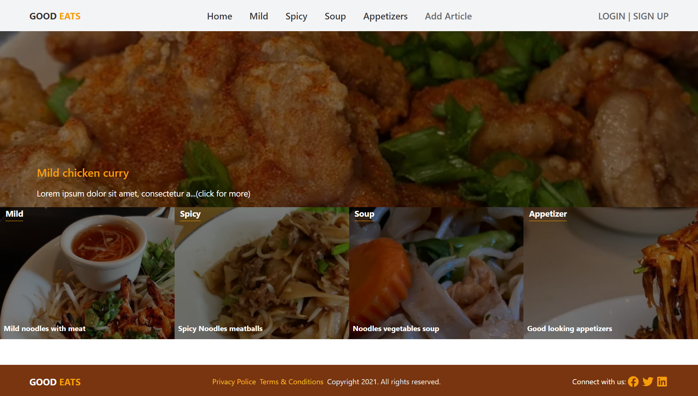

# Good Eats - Food Blog

> MVP for a basic food blog web application.




**Important**: This is not a responsive webpage so it might break on screens smaller than tablet size screen.

## Built With

- Ruby 3.0.2
- Rails 6.1.4
- PostgreSQL 12.7
- Tailwind CSS 2.0

## Live Demo

[Live Demo Link](https://powerful-lake-39450.herokuapp.com/)

## Getting Started

To get a local copy up and running, please follow these steps:

### Prerequisites

For this project, the following environment should be previously installed on your machine:

- Ruby 3.0.1
- Rails 6.1.4
- PostgreSQL 12.7
- Node 14.17.0 && Yarn 1.22.10

### Setup

- Go to your terminal bash and, on any directory of your preference, run

```sh
git clone git@github.com:omar-labana/food-blog.git
```

- Next, to go into the project root directory, run

```sh
cd food-blog
```

- To install all Ruby Gems this project requires, run

```sh
bundle install
```
### Install

- To start using the project run

```sh
yarn
rails db:create
rails db:migrate
rails db:seed
```
In orderto compile Tailwind CSS assets after you install it with yarn follow [this](https://www.youtube.com/watch?v=Q1aTo2I6Dxc&t=700s&ab_channel=Web-Crunch) guide or on a different terminal run 

```sh
bin/webpack-dev-server
```


When cloning the project please seed the database so you can have some written articles and votes. Categories wont be present unless you have seeded the database.

- To start your local host, run

```sh
rails s
```

- On the browser of your preference, you can go to http://127.0.0.1:3000/ and set it to mobile view format. Now, you can either "Login" with one of the previously added users (see list above) or you can "Signup" with a new user with the "Signup" link.

### Tests


- Run

```sh
rspec
```

Note: you need chrome for UI testing

## Author:

👤 **Omar Labana**

- GitHub: [@omar-labana](https://github.com/omar-labana)
- Twitter: [@panda4cs](https://twitter.com/Panda4cs)
- LinkedIn: [Omar Labana](https://www.linkedin.com/in/omarlabana/)

## 🤝 Contributing

Contributions, issues, and feature requests are welcome!

## Show your support

Give a ⭐️ if you like this project!

## Acknowledgments

- [Microverse](https://www.microverse.org/)
- [Nelson Sakwa](https://www.behance.net/sakwadesignstudio)


## 📝 License


This project is [MIT](https://opensource.org/licenses/MIT) licensed.